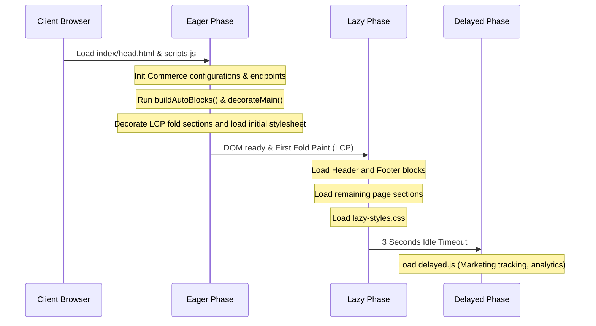

# Storefront Project Directory & File Structure

This document provides a detailed overview of the folder and file structure of the **AEM Edge Delivery Services (EDS) + Adobe Commerce** Storefront. It explains the purpose of each directory, inner files, page lifecycles, and how Commerce Drop-in dependencies are managed.

---

## 📂 Complete Directory Tree (Including Inner Layouts)

```text
├── .github/                       # CI/CD workflows and pull request templates
│   └── pull_request_template.md   # Guidelines and checklists for submitting pull requests
├── blocks/                        # Reusable UI Blocks decorated by EDS
│   ├── accordion/                 # Toggleable content accordion block
│   ├── cards/                     # General grid card layouts (image + text + link)
│   ├── carousel/                  # Slidable content carousel
│   ├── columns/                   # Multi-column responsive layout grids
│   ├── commerce-*/                # Blocks wrapping Adobe Commerce Drop-ins:
│   │   ├── commerce-cart/         # Shopping cart block
│   │   ├── commerce-checkout/     # Multi-step checkout flow block
│   │   ├── commerce-checkout-success/ # Post-purchase confirmation page block
│   │   ├── commerce-login/        # Customer sign-in forms
│   │   ├── commerce-mini-cart/    # Floating mini-cart drawer
│   │   └── ...                    # (Addresses, Wishlist, Orders, Returns, etc.)
│   ├── footer/                    # Site footer block
│   ├── header/                    # Responsive site header and navigation block
│   ├── hero/                      # High-impact top-of-page hero block
│   ├── modal/                     # Modal overlay container block
│   ├── product-details/           # Product detail page (PDP) wrapper block
│   ├── product-list-page/         # Category/Product Listing Page (PLP) block
│   ├── product-recommendations/   # Product recommendation carousel block
│   └── targeted-block/            # Personalization block displaying content by customer segment
├── cypress/                       # End-to-End integration tests
│   ├── cypress.base.config.js     # Base configuration sharing common paths and settings
│   ├── cypress.paas.config.js     # Cypress config for Commerce PaaS environment tests
│   ├── cypress.saas.config.js     # Cypress config for Commerce SaaS environment tests
│   ├── run-cypress.sh             # Helper bash runner script for Cypress suites
│   └── src/                       # Test suite source code
│       ├── actions/               # Reusable test user actions (adding to cart, logging in)
│       ├── assertions/            # Verification functions (checking pricing, cart count)
│       ├── fixtures/              # Mock data and test static fixtures
│       └── tests/e2eTests/        # Actual test spec files:
│           ├── verifyAuthUserCheckout.spec.js
│           ├── verifyProductSearch.spec.js
│           └── ...
├── fonts/                         # Web fonts served by EDS (WOFF2/WOFF)
├── icons/                         # SVG icons (AEM automatically inlines these)
├── models/                        # Source JSON configurations for Universal Editor (UE)
│   ├── _component-definition.json # Defines blocks and properties editable in UE
│   ├── _component-filters.json     # Rules showing what blocks can be added to templates
│   ├── _component-models.json     # Binds fields to variables for blocks
│   ├── _image.json                # Image component definition for UE
│   ├── _page.json                 # Page document template definition for UE
│   ├── _section.json              # Layout section config definition for UE
│   └── _text.json                 # Core text block definition for UE
├── scripts/                       # Core JavaScript and utilities
│   ├── __dropins__/               # Pre-built storefront Drop-in modules (built by postinstall):
│   │   ├── storefront-auth/       # Login, Sign Up, and Forgot Password modules
│   │   ├── storefront-cart/       # Cart state, coupon, and summary modules
│   │   ├── storefront-checkout/   # Payment, shipping, and billing modules
│   │   └── ...
│   ├── acdl/                      # Adobe Client Data Layer (ACDL) analytics library
│   ├── components/                # Custom reusable JS web components:
│   │   └── commerce-mini-pdp/     # Mini-pdp preview component (CSS + JS)
│   ├── initializers/              # Registration and initialization configs for Drop-ins:
│   │   ├── index.js               # Main initialization coordinator
│   │   ├── cart.js                # Inits cart drop-in & listens to local storage updates
│   │   ├── pdp.js                 # PDP configurations & currency mappings
│   │   └── ...                    # (Auth, Wishlist, Recommendations, Search, etc.)
│   ├── aem.js                     # Core AEM Library (NEVER MODIFY)
│   ├── commerce.js                # Core Commerce config, Graphql client setup, and headers
│   ├── commerce-events-collector.js # Capture storefront events for analytics
│   ├── commerce-events-sdk.js     # Events SDK for Adobe Commerce integrations
│   ├── scripts.js                 # Main entry point and page lifecycle manager
│   └── ue.js / ue-utils.js        # Universal Editor integration utilities
├── styles/                        # Global stylesheets
│   ├── styles.css                 # Critical global styles (LCP optimization)
│   ├── lazy-styles.css            # Lazy-loaded/below-the-fold styles
│   └── fonts.css                  # Custom font faces
├── tools/                         # Utility scripts and tools
│   └── pdp-metadata/              # Node script for generating offline PDP metadata
│       ├── pdp-metadata.js        # Crawls and caches GraphQL product schemas for SEO
│       └── queries/               # Products and variants GraphQL queries
│           ├── products.graphql.js
│           └── variants.graphql.js
├── .editorconfig                  # Editor coding style configuration
├── .eslintignore                  # ESLint ignore rules
├── .eslintrc.js                   # JavaScript linter configuration
├── .gitignore                     # Git ignore rules
├── .hlxignore                     # AEM Helix deployment ignore rules
├── .npmrc                         # Node registry and package lock settings
├── .renovaterc.json               # Renovate automatic dependency updater config
├── .stylelintrc.json              # CSS linter configuration
├── 404.html                       # Custom "Page Not Found" template
├── 418.html                       # Default site error fallback template
├── AGENTS.md                      # Guidelines for AI coding agents
├── CLAUDE.md                      # Claude environment settings
├── CODE_OF_CONDUCT.md             # Open-source community code of conduct
├── CONTRIBUTING.md                # Guidelines for repository contributors
├── LICENSE                        # Apache License 2.0 file
├── README.md                      # Project onboarding and developer guide
├── block-readme-template.md       # Documentation template for creating new blocks
├── build.mjs                      # GraphQL operations override script for drop-ins
├── component-definition.json      # Merged component definitions for Universal Editor
├── component-filters.json         # Merged component filters for Universal Editor
├── component-models.json          # Merged component models for Universal Editor
├── config---.json                 # Environment-specific configuration backup
├── config.json                    # Runtime configuration (GraphQL endpoint, headers, and store codes)
├── default-query.yaml             # AEM Helix indexing schema for sitemap/enrichment queries
├── default-site.json              # Template blueprint for provisioning new sites
├── default-sitemap.yaml           # Helix site map creation instructions
├── demo-config-aco.json           # Demo setup for Adobe Commerce Optimizer (ACO)
├── demo-config.json               # Demo configuration for the commerce backend
├── favicon.ico                    # Storefront browser icon
├── fstab.yaml                     # Folder/mountpoint mapping config for Helix
├── head.html                      # Global HTML head tags, importmaps, and preloading
├── package-lock.json              # Locked tree of installed npm dependencies
├── package.json                   # Package info, scripts, and npm dependencies
├── postinstall.js                 # Script to sync npm dependencies into scripts/__dropins__
└── sitemap-index.xml              # XML Index sitemap pointing to content sitemaps
```

---

## 🔍 Detailed Inner Directory Descriptions

### 🧱 `blocks/` (Inner Details)
A block is a component folder that houses a self-contained feature.
*   **Standard Block Files**:
    *   `{blockname}.js`: Uses standard browser DOM APIs to query contents within the block element and decorate them.
    *   `{blockname}.css`: Styled specifically for the block. To guarantee responsive and modular development, all CSS rules should be scoped inside `.blockname` selector classes.
*   **Drop-In Wrapper Blocks (e.g. `commerce-cart/`, `commerce-checkout/`)**:
    *   Import rendering/container scripts from `scripts/__dropins__/`.
    *   Inject containers directly inside the decorated DOM element. For example, `commerce-cart.js` imports `CartSummaryList` and `OrderSummary` from `@dropins/storefront-cart/containers/...` and mounts them using Preact-rendered containers.

### 🧪 `cypress/src/` (Inner Details)
Contains the test codebase.
*   `actions/`: Scripts defining end-user functions, such as completing a login flow, selecting options on a product page, or inputting card details during checkout.
*   `assertions/`: Defines standard validation expectations, such as ensuring correct pricing calculations or verified success status elements.
*   `fixtures/`: Stores static assets and environment JSON states used to mock network requests or input data.
*   `tests/e2eTests/`: Holds E2E spec files:
    *   `verifyAuthUserCheckout.spec.js`: Validates checkout flow from cart to success page for logged-in accounts.
    *   `verifyGuestUserCheckout.spec.js`: Validates guest customer flow.
    *   `verifyProductListPage.spec.js`: Validates sorting, filtering, and paging on category lists.

### 🧩 `models/` (Inner Details)
This folder houses schema definitions written in JSON for the Universal Editor (UE).
*   `_component-definition.json`: Defines components (name, icon, categorization) that can be inserted by content authors.
*   `_component-models.json`: Declares field-mapping schemas so editing field controls map to DOM attributes or CSS classes.
*   `_image.json`, `_text.json`, `_section.json`: Blueprint files specifying how standard media and text modules behave in the editing frame.
*   `merge-json-cli`: Used during the build script to merge these individual JSON specs into the root files (`component-definition.json`, `component-models.json`, `component-filters.json`).

### 📜 `scripts/` (Inner Details)
Serves as the core runtime.
*   **`scripts/initializers/`**:
    *   Each commerce flow area (Cart, Checkout, Account, PDP, Wishlist) has an initializer.
    *   These register specific endpoints, configure basic parameters (e.g., currency, endpoints), subscribe to data change events (using Event Bus or Web Event listeners), and manage local storage caching.
    *   `index.js`: Combines and boots up all initializers before page load.
*   **`scripts/components/`**:
    *   Custom local Web Components, like the `commerce-mini-pdp` which is used to provide preview modals or light overlays for product specifications without loading a full page structure.
*   **`scripts/__dropins__/`**:
    *   The compiled output files of the Adobe Commerce Drop-ins (copied by `postinstall.js`). It includes the rendering engine (Preact under the hood), GraphQL queries, and state management APIs for storefront functionalities.

### 🛠️ `tools/pdp-metadata/` (Inner Details)
Used to optimize SEO indexing for catalog-driven pages (Product Detail Pages).
*   **`pdp-metadata.js`**: A build-time node CLI script that queries product and variant schemas directly from the Adobe Commerce API.
*   **`queries/`**: Graphql script templates specifying product/variant nodes to query and generate flat metadata definitions used by Edge Delivery Services to render SEO tags.

---

## 🛠️ Key Build Scripts & Execution Flows

### 🔁 The Dependency Sync Lifecycle (`postinstall.js` & `build.mjs`)
1.  Developer runs `npm install`.
2.  `build.mjs` triggers, using `@dropins/build-tools` to customize and rewrite internal GraphQL fragment queries (e.g., stripping out downloadables).
3.  `postinstall.js` runs next:
    *   Clears `/scripts/__dropins__/` to avoid stale assets.
    *   Copies appropriate client-serveable files from `node_modules/@dropins` to `/scripts/__dropins__/`.
    *   Prepares event collection and data layer scripts in `/scripts/`.
4.  The site is ready for local running (`npm start` / `aem up`).

### 🕒 Loading Order & Performance Lifecycle (`scripts.js`)

