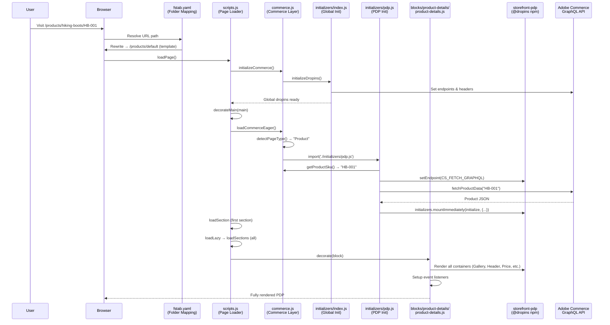

# Product Detail Page (PDP) — Complete Walkthrough

## Architecture Overview



---

## File Inventory

| File | Role |
|------|------|
| [fstab.yaml](file:///home/ajaykumar.prajapati@brainvire.com/htdocs/aem/bvi-acs/fstab.yaml) | URL folder-mapping: rewrites `/products/*` → `/products/default` |
| [content/products/default.html](file:///home/ajaykumar.prajapati@brainvire.com/htdocs/aem/bvi-acs/content/products/default.html) | The CMS-authored HTML template page containing the `product-details` block markup |
| [scripts/scripts.js](file:///home/ajaykumar.prajapati@brainvire.com/htdocs/aem/bvi-acs/scripts/scripts.js) | Main entry point — orchestrates Eager → Lazy → Delayed loading phases |
| [scripts/commerce.js](file:///home/ajaykumar.prajapati@brainvire.com/htdocs/aem/bvi-acs/scripts/commerce.js) | Commerce configuration, page-type detection, SKU extraction, GraphQL setup |
| [scripts/initializers/index.js](file:///home/ajaykumar.prajapati@brainvire.com/htdocs/aem/bvi-acs/scripts/initializers/index.js) | Global dropin initialization (auth, cart, recaptcha, headers) |
| [scripts/initializers/pdp.js](file:///home/ajaykumar.prajapati@brainvire.com/htdocs/aem/bvi-acs/scripts/initializers/pdp.js) | PDP-specific eager init: fetches product data, preloads assets, mounts PDP dropin |
| [blocks/product-details/product-details.js](file:///home/ajaykumar.prajapati@brainvire.com/htdocs/aem/bvi-acs/blocks/product-details/product-details.js) | Block decorator: builds DOM layout, renders all UI containers, wires events |
| [blocks/product-details/product-details.css](file:///home/ajaykumar.prajapati@brainvire.com/htdocs/aem/bvi-acs/blocks/product-details/product-details.css) | Block styling: responsive grid layout for gallery + right column |
| [scripts/\_\_dropins\_\_/storefront-pdp/](file:///home/ajaykumar.prajapati@brainvire.com/htdocs/aem/bvi-acs/scripts/__dropins__/storefront-pdp) | Pre-built Adobe Commerce PDP dropin (API, containers, render engine) |

---

## Step-by-Step Flow

### 1. URL Routing & Folder Mapping

When a user visits a product URL like `/products/hiking-boots/HB-001`:

```yaml
# fstab.yaml (lines 19-20)
folders:
  /products/: /products/default
```

The Edge Delivery Services **folder mapping** rewrites any URL under `/products/` to serve the **template page** at `/products/default`. This means:
- `/products/hiking-boots/HB-001` → serves `content/products/default.html`
- `/products/blue-shirt/BS-042` → same template page

The template page at [default.html](file:///home/ajaykumar.prajapati@brainvire.com/htdocs/aem/bvi-acs/content/products/default.html) is authored in the CMS and contains:

```html
<div class="product-details">
  <div><div><p>defaultSku</p></div><div><p>ADB174</p></div></div>
</div>
```

This is the standard AEM block markup — a `product-details` block with a configuration row: `defaultSku = ADB174`. The `defaultSku` is only used when editing the template directly in the Universal Editor (UE) or Dark Alley (DA); for real product pages, the SKU comes from the URL.

---

### 2. Page Loading — Eager Phase

[scripts.js](file:///home/ajaykumar.prajapati@brainvire.com/htdocs/aem/bvi-acs/scripts/scripts.js) calls `loadPage()` which triggers `loadEager(document)`:

```javascript
// scripts.js — loadEager() (line 142-169)
async function loadEager(doc) {
  decorateTemplateAndTheme();
  const main = doc.querySelector('main');
  await initializeCommerce();     // Step 2a
  decorateMain(main);             // Step 2b
  applyTemplates(doc);
  await loadCommerceEager();      // Step 2c
  await loadSection(main.querySelector('.section'), waitForFirstImage);
}
```

#### 2a. `initializeCommerce()` — [commerce.js:335-348](file:///home/ajaykumar.prajapati@brainvire.com/htdocs/aem/bvi-acs/scripts/commerce.js#L335-L348)

1. Fetches `/config.json` (cached in sessionStorage for 2 hours)
2. Initializes the config system with store-specific values (endpoints, headers, store codes)
3. Creates **two GraphQL clients**:
   - `CORE_FETCH_GRAPHQL` — points to the core Magento endpoint (for cart, auth, etc.)
   - `CS_FETCH_GRAPHQL` — points to the **Catalog Service** endpoint (for product data)
4. Calls `initializeDropins()` from [initializers/index.js](file:///home/ajaykumar.prajapati@brainvire.com/htdocs/aem/bvi-acs/scripts/initializers/index.js):
   - Sets up auth headers
   - Subscribes to event bus events (auth, cart data, customer group)
   - Fetches global placeholders (labels/translations)
   - Imports auth + personalization initializers
   - Kicks off the cart initializer

#### 2b. `decorateMain()` — [scripts.js:129-136](file:///home/ajaykumar.prajapati@brainvire.com/htdocs/aem/bvi-acs/scripts/scripts.js#L129-L136)

Standard AEM decoration pipeline:
1. `decorateLinks()` — localizes links for multi-store
2. `decorateIcons()` — loads SVG icons
3. `buildAutoBlocks()` — creates synthetic blocks (hero, fragments)
4. `decorateSections()` — wraps sections, adds `section` class
5. `decorateBlocks()` — marks blocks for lazy loading
6. `decorateButtons()` — styles authored links as buttons

At this point, the DOM has a `<div class="product-details block">` element ready for decoration.

#### 2c. `loadCommerceEager()` — [commerce.js:269-276](file:///home/ajaykumar.prajapati@brainvire.com/htdocs/aem/bvi-acs/scripts/commerce.js#L269-L276)

```javascript
export async function loadCommerceEager() {
  const pageType = detectPageType();          // → "Product"
  initializeAdobeDataLayer(pageType);         // Push page-view event
  await handleCommercePageType(pageType);     // → imports pdp.js
  notifyUI('lcp');                            // Emits 'aem/lcp' event
}
```

**`detectPageType()`** scans the DOM for known block class names:
- `.product-details` → `"Product"`
- `.product-list-page` → `"Category"`
- `.commerce-cart` → `"Cart"`
- `.commerce-checkout` → `"Checkout"`

**`handleCommercePageType("Product")`** dynamically imports the PDP initializer:

```javascript
await import('./initializers/pdp.js');
```

---

### 3. PDP Initializer — [initializers/pdp.js](file:///home/ajaykumar.prajapati@brainvire.com/htdocs/aem/bvi-acs/scripts/initializers/pdp.js)

This is the **eager** PDP setup — it runs before the block's `decorate()` function:

```javascript
await initializeDropin(async () => {
  // 1. Set the GraphQL endpoint for the PDP dropin
  setEndpoint(CS_FETCH_GRAPHQL);

  // 2. Preload PDP assets (JS chunks + main product image)
  preloadPDPAssets();

  // 3. Extract SKU from URL
  const sku = getProductSku();    // → "HB-001"
  const optionsUIDs = getOptionsUIDsFromUrl();

  // 4. If no SKU and not in Universal Editor → 404
  if (!sku && !IS_UE) return loadErrorPage();

  // 5. Fetch product data + labels IN PARALLEL
  const [product, labels] = await Promise.all([
    fetchProductData(sku, { optionsUIDs, skipTransform: true })
      .then(preloadImageMiddleware),
    fetchPlaceholders('placeholders/pdp.json'),
  ]);

  // 6. Mount the PDP dropin immediately with pre-fetched data
  return initializers.mountImmediately(initialize, {
    sku,
    optionsUIDs,
    langDefinitions: { default: { ...labels } },
    models: { ProductDetails: { initialData: { ...product } } },
    acdl: true,
    persistURLParams: true,
  });
})();
```

#### SKU Extraction — `getProductSku()` — [commerce.js:778-784](file:///home/ajaykumar.prajapati@brainvire.com/htdocs/aem/bvi-acs/scripts/commerce.js#L778-L784)

```javascript
export function getProductSku() {
  // If on template page AND in Universal Editor → read from block config
  if (isProductTemplate() && (IS_UE || IS_DA)) {
    return getDefaultSkuFromBlock();   // → reads "ADB174" from block markup
  }
  // Otherwise → read from <meta name="sku"> or parse URL
  return getMetadata('sku') || getSkuFromUrl();
}
```

**`getSkuFromUrl()`** uses a regex to extract the last segment:
```javascript
// URL: /products/hiking-boots/HB-001
path.match(/\/products\/[\w|-]+\/([\w|-]+)$/);  // → "HB-001"
```

#### Asset Preloading — `preloadPDPAssets()` — [pdp.js:52-73](file:///home/ajaykumar.prajapati@brainvire.com/htdocs/aem/bvi-acs/scripts/initializers/pdp.js#L52-L73)

Injects `<link rel="preload">` tags for:
- PDP dropin JS files (api.js, render.js, container scripts)
- The main product image (extracted from JSON-LD or `<meta og:image>`)

This ensures the browser starts downloading these resources before they're actually needed.

#### `preloadImageMiddleware()` — [pdp.js:119-144](file:///home/ajaykumar.prajapati@brainvire.com/htdocs/aem/bvi-acs/scripts/initializers/pdp.js#L119-L144)

After fetching the product data, this middleware pre-renders the first product image using the dropin's `Image` component. This warms the browser's image cache so the gallery renders instantly.

---

### 4. Block Decoration — [product-details.js](file:///home/ajaykumar.prajapati@brainvire.com/htdocs/aem/bvi-acs/blocks/product-details/product-details.js)

When AEM's section loader processes the section containing `product-details`, it calls `decorate(block)`. This is the **lazy** phase rendering:

#### 4a. Build the DOM Layout (lines 99-138)

The block's authored content is **replaced entirely** with a structured HTML fragment:

```
product-details__alert         ← Error/success alerts
product-details__wrapper       ← CSS Grid container
├── product-details__left-column
│   └── product-details__gallery     ← Desktop gallery (thumbnails)
└── product-details__right-column
    ├── product-details__header      ← Product name
    ├── product-details__price       ← Price display
    ├── product-details__gallery     ← Mobile gallery (dots/carousel)
    ├── product-details__short-description
    ├── product-details__gift-card-options
    ├── product-details__configuration
    │   ├── product-details__options   ← Color/size swatches
    │   ├── product-details__quantity  ← Quantity selector
    │   └── product-details__buttons
    │       ├── __add-to-cart
    │       └── __add-to-wishlist
    ├── product-details__description  ← Full description
    └── product-details__attributes   ← Product specs
```

#### 4b. Render Dropin Containers (lines 164-247)

All containers are rendered **in parallel** using `Promise.all()`:

| Container | Target Element | Props |
|-----------|---------------|-------|
| `ProductGallery` (mobile) | `$galleryMobile` | `controls: 'dots'`, arrows, videos |
| `ProductGallery` (desktop) | `$gallery` | `controls: 'thumbnailsColumn'`, arrows |
| `ProductHeader` | `$header` | Product name display |
| `ProductPrice` | `$price` | Price with currency |
| `ProductShortDescription` | `$shortDescription` | Brief description |
| `ProductOptions` | `$options` | Swatch selectors (color, size) |
| `ProductQuantity` | `$quantity` | Qty +/- selector |
| `ProductGiftCardOptions` | `$giftCardOptions` | Gift card fields (if applicable) |
| `ProductDescription` | `$description` | Full product description |
| `ProductAttributes` | `$attributes` | Specifications table |
| `WishlistToggle` | `$wishlistToggleBtn` | Heart icon toggle |

> [!NOTE]
> The gallery renders **twice** — once for mobile (carousel with dots) and once for desktop (with thumbnail column). CSS hides the appropriate one based on viewport width at the 900px breakpoint.

#### 4c. Add to Cart / Update Button (lines 250-333)

The button has **dual mode** behavior:

- **Add Mode** (default): Shows "Add to Cart", calls `addProductsToCart()`
- **Update Mode** (when `?itemUid=...` is in URL): Shows "Update in Cart", calls `updateProductsFromCart()` then redirects to `/cart`

```javascript
const urlParams = new URLSearchParams(window.location.search);
const itemUidFromUrl = urlParams.get('itemUid');
```

The mode switches dynamically via the `cart/data` event listener — if the `itemUid` from the URL exists in the cart, it enters update mode.

#### 4d. Event Listeners (lines 336-408)

| Event | Behavior |
|-------|----------|
| `pdp/valid` | Enables/disables "Add to Cart" button based on whether all required options are selected |
| `pdp/values` | Updates the wishlist toggle with current option selections |
| `wishlist/alert` | Shows a temporary alert when product is added/removed from wishlist |
| `cart/data` | Checks if current product is already in cart → switches to update mode |
| `aem/lcp` | Sets JSON-LD structured data + meta tags for SEO (if not prerendered) |

---

### 5. SEO — JSON-LD & Meta Tags

When the `aem/lcp` event fires (after the first section is painted), the block:

1. **JSON-LD** (lines 413-493): Fetches product variants via GraphQL and builds a `schema.org/Product` JSON-LD script with offers for each variant
2. **Meta Tags** (lines 518-539): Sets `<meta>` tags for `title`, `description`, `og:type`, `og:image`, `product:price:amount`, etc.

> [!IMPORTANT]
> If the product data was **prerendered** (server-side JSON-LD exists from aem-commerce-prerender), the block skips this step to avoid duplicates.

---

### 6. Responsive Layout — [product-details.css](file:///home/ajaykumar.prajapati@brainvire.com/htdocs/aem/bvi-acs/blocks/product-details/product-details.css)

- **Mobile** (< 900px): Single column layout. Left column (desktop gallery) is hidden. Mobile gallery shows inline with dot controls.
- **Desktop** (≥ 900px): Two-column grid (6 + 5 columns out of 12). Left column shows desktop gallery with thumbnail sidebar. Right column mobile gallery is hidden.

---

## Key Design Decisions

1. **Template Pattern**: A single CMS page (`/products/default`) serves all product URLs via folder mapping. The actual product is resolved from the URL at runtime.

2. **Eager vs Lazy Split**: Product data is fetched **eagerly** (before block decoration) in `pdp.js`, so the dropin containers have data immediately when they render. This optimizes LCP.

3. **Dropin Architecture**: The `@dropins/storefront-pdp` package provides pre-built Preact-based containers. The block simply creates DOM placeholders and calls `render()` on each container.

4. **Event-Driven**: All inter-component communication uses the `@dropins/tools/event-bus`. The block listens but doesn't emit — the dropin containers emit events internally.

5. **Dual GraphQL Clients**: The PDP uses the **Catalog Service** endpoint (`CS_FETCH_GRAPHQL`) for product reads, while cart/auth operations use the **Core** endpoint (`CORE_FETCH_GRAPHQL`).
